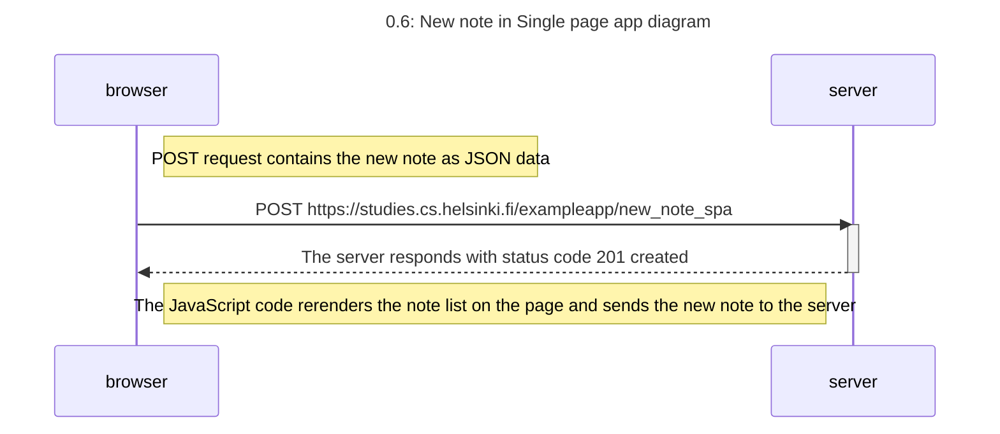

```mermaid

sequenceDiagram
    title 0.6: New note in Single page app diagram
    participant browser
    participant server

    Note right of browser: POST request contains the new note as JSON data

    browser->>server: POST https://studies.cs.helsinki.fi/exampleapp/new_note_spa
    activate server
    server-->>browser: The server responds with status code 201 created
    deactivate server

    Note right of browser: The JavaScript code rerenders the note list on the page and sends the new note to the server

```